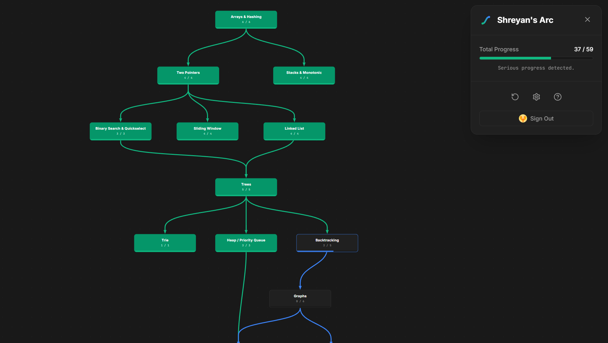

#  Shreyan's Arc

An interactive Data Structures & Algorithms (DSA) roadmap and progress tracker. Built to study coding patterns and track interview prep.



## 🛠️ Tech Stack

- **Frontend**: React 19, TypeScript, Tailwind CSS, Vite
- **Backend/Auth**: Firebase (Firestore, Google Sign-In)
- **AI Tools**: GitHub Copilot, Antigravity

---

## ✨ Features

- **Interactive Canvas**: Pan, zoom, and drag nodes to customize your roadmap layout.
- **Pattern Tracking**: Focus on handpicked questions grouped by DSA patterns.
- **Guest Mode**: Works instantly. Saves progress to `localStorage` with zero configuration.
- **Cloud Sync**: Log in with Google to sync progress across multiple devices.

---

## 🚀 Local Setup

### 1. Clone & Install
```bash
git clone https://github.com/ShreyanDev5/shreyans-arc.git
cd shreyans-arc
npm install
```

### 2. Configure Firebase (Optional)
If you do not configure Firebase, the app runs in **Guest Mode** (saving progress to local storage). To enable Cloud Sync:

1. Copy `.env.example` to `.env`:
   ```bash
   cp .env.example .env
   ```
2. Create a project in the Firebase Console, enable **Google Sign-In** and **Firestore Database**.
3. Fill in your project keys in `.env`:
   ```env
   VITE_FIREBASE_API_KEY=
   VITE_FIREBASE_AUTH_DOMAIN=
   VITE_FIREBASE_PROJECT_ID=
   VITE_FIREBASE_STORAGE_BUCKET=
   VITE_FIREBASE_MESSAGING_SENDER_ID=
   VITE_FIREBASE_APP_ID=
   ```

### 3. Run
```bash
npm run dev
```
Open `http://localhost:5173` (or the port shown in your terminal).

---

## 📦 Build

```bash
npm run build
```
Production assets are generated in the `/dist` folder.

---
*Inspired by NeetCode.io.*
