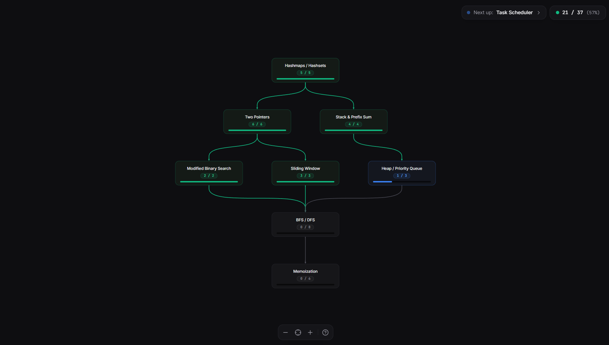

#  Shreyan's Arc

An interactive Data Structures & Algorithms (DSA) roadmap and progress tracker featuring 58 curated problems across 17 core patterns.

[](https://shreyans-arc.vercel.app)

---

## Preview

| Interactive Roadmap Canvas |
| :---: |
|  |

---

## Features

- **Interactive Visual Canvas**: Pan, zoom, and drag nodes across an interconnected DSA topic graph.
- **58 Curated Problems**: Practice handpicked questions categorized across 17 core algorithmic patterns.
- **Offline Guest Mode**: Track problem completions instantly with zero login required via `localStorage`.
- **Real-Time Cloud Sync**: Sign in with Google to persist and sync roadmap progress across devices via Firebase Cloud Firestore.
- **Direct LeetCode Practice**: Access instant problem modals with difficulty tags and one-click problem links.

---

## Tech Stack

- **Frontend**: React 19, TypeScript, Vite, Tailwind CSS
- **Backend & Services**: Firebase (Authentication, Cloud Firestore)
- **Deployment & Infra**: Vercel
- **AI Tooling**: Antigravity

---

## Project Structure

```text
shreyans-arc/
├── public/              # Static brand assets and preview images
├── src/
│   ├── components/      # UI components (Canvas, Modals, Sidebar, Settings)
│   ├── data/            # Roadmap layout definitions and question bank
│   ├── lib/             # Firebase SDK client initialization
│   ├── App.tsx          # Main canvas viewport and state manager
│   └── index.tsx        # React application entry point
├── .env.example         # Template for Firebase credentials
├── package.json         # Dependencies and scripts
└── vite.config.ts       # Vite bundler configuration
```

---

## Getting Started

### Prerequisites

- **Node.js**: `v18.0.0` or higher
- **npm**: `v9.0.0` or higher

### 1. Clone & Install

```bash
git clone https://github.com/ShreyanDev5/shreyans-arc.git
cd shreyans-arc
npm install
```

### 2. Environment Setup (Optional)

The application runs in **Guest Mode** by default with full offline functionality. To enable Google Sign-In and Cloud Firestore sync:

- **macOS / Linux / PowerShell**: `cp .env.example .env`
- **Windows (CMD)**: `copy .env.example .env`

Populate `.env` with your Firebase credentials:
```env
VITE_FIREBASE_API_KEY=your_api_key
VITE_FIREBASE_AUTH_DOMAIN=your_auth_domain
VITE_FIREBASE_PROJECT_ID=your_project_id
VITE_FIREBASE_STORAGE_BUCKET=your_storage_bucket
VITE_FIREBASE_MESSAGING_SENDER_ID=your_sender_id
VITE_FIREBASE_APP_ID=your_app_id
```

### 3. Run Locally

```bash
npm run dev
```
Open `http://localhost:5173` in your browser.

---

## Deployment

- **Production URL**: [shreyans-arc.vercel.app](https://shreyans-arc.vercel.app)
- **Hosting Platform**: [Vercel](https://vercel.com)

---

## Author

**Shreyan Sardar**
- **Portfolio**: [shreyandev.vercel.app](https://shreyandev.vercel.app)
- **GitHub**: [@ShreyanDev5](https://github.com/ShreyanDev5)
- **LinkedIn**: [shreyansardar](https://www.linkedin.com/in/shreyansardar/)
